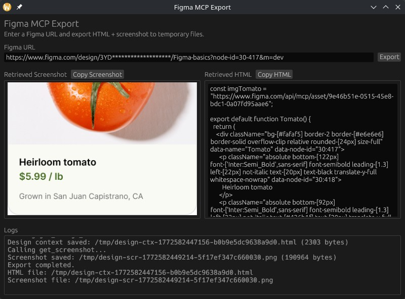

# figma-mcp-export

Convert a Figma design into code by using the Figma MCP server. This program currently only supports the remote Figma MCP server.



## Usage

1. Obtain a Figma remote MCP server client ID and client secret.
   
   Hint: You can add the Figma remote MCP server to Claude code and grab the credentials from the `figma-remote-mcp` section in `~/.claude/.credentials.json`.
2. Create a `figma-client-creds.json` file in the app working directory with the credentials:
   ```
   {
     "client_id": "...",
     "client_secret": "..."
   }
   ``` 
3. Select something in your Figma design, right-click it and hit "Copy link to selection"
4. Run the app with `cargo run`
5. Paste your link into the app and hit "Export".
6. The app will call `get_screenshot` and `get_design_context` on the Figma MCP server to grab a screenshot of the design and generate code.